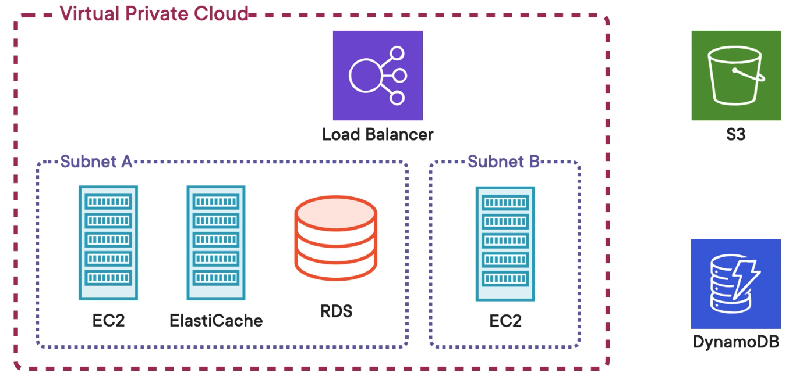

# Getting Inside the Virtual Machine with EC2 and VPC

## EC2
Virtual machine that runs software of your choice

Elastic IP
Load balancers
Auto Scaling Groups
## VPC
Virtual private cloud

Separates resources from user to user on AWS

Each resource on the VPC has its own private IP address

VPC is free! (up to 5)

## Creating a Virtual Private Cloud (VPC)

**Security Group** - defines allowed incoming/outgoing IP addresses and ports. Kind of like a mini-firewall.

VPCs use **routing tables** to configure routing destinations for traffic coming out of the VPC

Network Access Control List - acts as an IP filtering table

Subnet - an isolated area inside a Virtual Private Cloud with its own CIDR block, routing table, and NACL. Each VPC can have multiple subnets. An instance must be inside a subnet.

## Creating an EC2 Instance
Created Pizza-project EC2. Configured inbound rules for SSH (22) and TCP (3000)

## Connecting to an EC2 Instance

**Elastic IP** Public IP addresses that are created, destroyed, and assigned independently. If the instance is destroyed, the public IP address can still exist and be associated with another instance.

`Elastic IPs -- Allocate Elastic IP address -- Associate Elastic IP Address`

`chmod 400 <path-to-pem-file>`
`chmod 400 ~/Desktop/MasonsKey.pem`

`ssh -i <pem-file> ec2-user@<ec2-ip>`
`ssh-i ~/Desktop/MasonsKey.pem ec2-user@54.201.141.160`

## Updating and Deploying to an EC2 Instance

Update the default AMI
`sudo yum update`

##  Scaling EC2 Instances