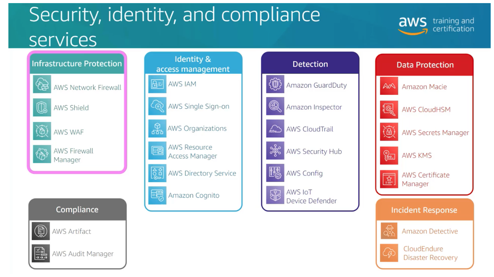

# Benefits of Cloud Computing

- Agility
- Elasticity
- Cost Savings
- Deploy globally in minutes

# AWS Global Infrastructure

Multiple Regions worldwide; each include multiple AZs

- Local Zones
- Wavelength Zones
- Direct Connect Locations
- Edge Locations
- Regional Edge Caches

# Core Technologies: Compute

Develop, deploy, run, and scale workloads in the AWS Cloud

1. EC2
    - Elasticity
    - Control
    - Flexibility
    - Integrated
    - Reliable
    - Secure
    - Cost-Effective
    - Easy
1. EC2 Auto Scaling
1. Elastic Load Balancing
1. Elastic Container Service
1. Elastic Kubernetes Service
1. Lambda

# Core Technologies: Storage

1. Elastic Block Store - persistent block-level storage
  - persistent independently from instance
  - used like a physical hard drive
  - automatically replicated
  - attached to any instance in the same AZ
  - on EBS volume to one instance
  - one instance to many volumes 
  - allow point in time snapshots to S3
2. S3 - infinite scalability, greater analysis, and faster data retrieval
  - data lakes
  - backup and storage
  - application hosting
  - media hosting
  - software delivery

  Storage Classes
  - Standard
  - Standard-Infrequent Access (IA)
  - One Zone - IA
  - Glacier

3. S3 Glacier - data archiving and backup
4. Storage Gateway - integrate cloud storage with on-site workloads
5. Elastic File System - file storage for EC2 instances
6. FSx - file storage for widely used file systems

# Core Technologies: Database

- Amazon RDS - Relational Database Service
- Amazon DynamoDB - NoSQL
- Amazon ElastiCache - fast, managed information retrieval

# Core Technologies: Networking

- VPC
- Security Groups - control access to instances
- Network Access Control Lists - control access to subnets
- Route 53 - route end users to internet applications (DNS Service)

# Core Technologies: Security

AWS Shared Responsible Model 

