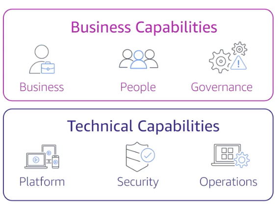

# Migration Strategies

## The Seven R's
1. Rehost - lift and shift
    Automated with tools such as AWS Application Migration Service
2. Replatform - lift, tinker, and shift making targeted cloud optimizations
3. Relocate - hypervisor-level lift and shift
    - Specific to VMware Cloud on AWS
4. Refactor - modernize
5. Retire
6. Retain/Revisit - keeping certain applications on-prem
7. Repurchase - moving workflows to SAAS

# Architectural Best Practices

1. Design for failure and nothing fails
2. Build security in every layer
3. Leverage diffferent storage options
4. Implement elasticity
5. Think parallel
6. Loose coupling sets you free
7. Don't fear constraints

## Well-Architected Framework
- Systematic approach for evaluating and implementing architectures
-Tool in the console

1. Operational Excellence
2. Security
3. Reliability
4. Performance Efficiency
5. Cost Optimization
6. Sustainability

## Best Practices for Cost Optimization
1. Rightsizing instances
1. Increasing application elasticity
1. Choosing the right pricing model
1. Optimizing storage

## AWS Cloud Adoption Framework (AWS CAF)

# Other Solution Design Resources

## Use Case Studies
aws.amazon.com/solutions/case-studies

AWS Solutions and AWS Solution Space

AWS Quick Starts
